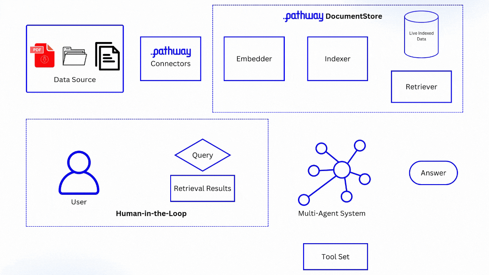

# Dynamic  Agentic RAG With Pathway

This repository offers resources for conducting inference and assessment of state-of-the-art pipelines for Retrieval-Augmented Generation (RAG). Tailored to accommodate both specialized and general applications, these pipelines deliver sophisticated functionalities in active retrieval and the dynamics of knowledge graphs.

Pipelines:
- HybridFL- specialized pipeline for legal and financial domains.
- FLARE- Generalized active retrieval pipeline using closed source models
- DRAGIN- Generalized active retrieval pipeline using open source models


---

## Table of Contents

1. [Features](#features)  
2. [System Design](#system-design)  
3. [System Architecture](#system-architecture)  
4. [Installation](#installation)  
5. [Usage](#usage)  
6. [Hardware Requirements](#hardware-requirements)  
7. [Run Demo UI](#run-demo-ui)    
8. [Contributors](#contributors)  


---

## Features

- Evaluation notebooks for individual pipelines in the notebooks folder.  
- Streamlit demo UI.  
- Dynamic Knowledge Graph building using Pathway in the dynamic_kg_updation folder (it comes with a seperate README).  
- Custom Datasets for evaluation in the datasets folder.

---
## System Design

---

## System Architecture
#### FLARE / DARGIN:

---
#### HybridFL:

---


## Installation

#### Step 0: Create a Python virtual environment and install dependencies.  

1. Create a virtual environment:  

   ```bash
   python -m venv env
   ```
3. Activate the environment:  
   - Linux/Mac:  
     ```bash
     source env/bin/activate
     ```
   - Windows:  
     ```bash
     .\env\Scripts\activate
     ```
4. Install the required packages:  
   ```bash
   pip install -r requirements.txt
   ```

---

## Usage

#### Step 1: Build and Run Docker for Financial Corpus

1. Navigate to the `DocumentStore` folder:  
   ```bash
   cd DocumentStore
   ```
2. Build the Docker image:  
   ```bash
   docker build -t vector_indexer .
   ```
3. Run the Docker container:  
   ```bash
   docker run -v files-for-indexing -p 8000:8000 vector_indexer
   ```

#### Step 2: Build and Run Docker for Legal Corpus

1. Navigate to the `DocumentStore_legal` folder:  
   ```bash
   cd DocumentStore_legal
   ```
2. Build the Docker image:  
   ```bash
   docker build -t vector_indexer2 .
   ```
3. Run the Docker container:  
   ```bash
   docker run -v files-for-indexing -p 8001:8001 vector_indexer2
   ```

#### Step 3: Run Evaluation Notebooks

0. Make sure your current working directory is the root directory.

1. Navigate to the `notebooks` folder and execute:  
   - **Baseline evaluation**: `baseline.ipynb`  
   - **FLARE evaluation**: `FLARE.ipynb`  
   - **HybridFL evaluation**: `HybridFL.ipynb`  
2. For advanced evaluation using the Dragin framework:  
   - Ensure your system has at least **16 GB VRAM**.  
   - Navigate to the `dragin` folder within `notebooks` and run `eval.ipynb`.

---

## Hardware Requirements

- Minimum GPU VRAM: 16 GB (for Dragin evaluation).  
- Ensure Docker is installed and configured on your machine.  

---
## Run Demo UI

<!-- - to run the entire frontend `streamlit run main.py` -->
1. Navigate to the `frontend` folder:  
   ```bash
   cd frontend
   ```
2. Run the Streamlit app:  
   ```bash
   streamlit run main.py
   ```


## Contributors

